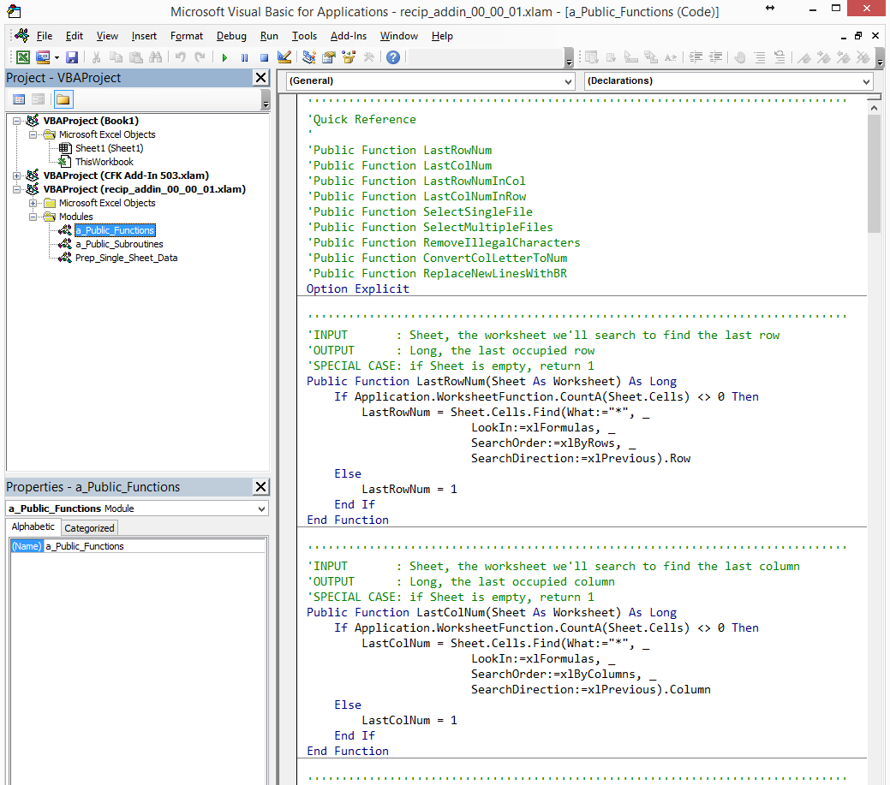

This document is largely inspired by the [Ruby Style Guide](https://github.com/bbatsov/ruby-style-guide).

# Prelude
> No one man should have all that power.<br/>
> -- Kanye West

This is an evolving document. Submit a pull request and start the conversation!

# VBA Style Guide

## Source Code Layout

> Not complicated, it's simple.<br/>
> -- Big Sean

* Limit lines to 80 characters.

* Use 4-character tabs to indent.

  ```vb
  'Bad
  If blnSomething Then
    Msgbox "True" '<~ 2-character indents
  Else
    Msgbox "False"
  End If

  'Good
  If blnSomething Then
      Msgbox "True" '<~ 4-character indents
  Else
      Msgbox "False"
  End If
  ```

* All conditionals, loops and blocks should be indented.

  ```vb
  'Bad
  If lngNumber >= 0 Then
  Msgbox "Yep"
  Else
  Msgbox "Nope"
  End

  'Good
  If lngNumber >= 0 Then
      Msgbox "Yep"
  Else
      Msgbox "Nope"
  End

  'Bad
  For lngIndex = 1 To lngLastRow
  lngCounter = lngCounter + lngIndex
  Next lngIndex

  'Good
  For lngIndex = 1 To lngLastRow
      lngCounter = lngCounter + lngIndex
  Next lngIndex

  'Bad
  With wksSource
  Set rngSource = .Range(.Cells(1, 1), .Cells(lngLastRow, 1))
  End With

  'Good
  With wksSource
      Set rngSource = .Range(.Cells(1, 1), .Cells(lngLastRow, 1))
  End With
  ```

* Do not write multiple statements on a single line (using `:`).

  ```vb
  'Bad
  For i = 1 To 10: DoSomething(i): Next i

  'Good
  For i = 1 To 10
      DoSomething(i)
  Next i
  ```

## Variables and Naming

> Oh that looks like what's-her-name, chances are it's what's-her-name.<br/>
> -- Drake

* Use `Option Explicit` to mandate variable declaration.

  ```vb
  'Bad
  Public Sub MyMacro()
      'do something
  End Sub

  'Good
  Option Explicit
  Public Sub MyMacro()
      'do something
  End
  ```

* Declare variable types explicitly.

  ```vb
  'Bad
  Dim MyNumber
  Dim MyBlock
  Dim MyVariable

  'Good
  Dim MyNumber As Long
  Dim MyBlock As Range
  Dim MyVariable As Variant
  ```

* When declaring variables on one line, they ALL must be declared explicitly.

 ```vb
 'Bad
 Dim lngLastRow, lngLastCol As Long '<~ lngLastRow is a Variant, NOT a Long
 
 'Good
 Dim lngLastRow As Long, lngLastCol As Long '<~ both variables are Long
 ```

* Use a two statement declaration for objects rather than the `Dim X As New Y` syntax.

 ```vb
 'Bad
 Dim col As New Collection
 
 'Good
 Dim col As Collection
 Set col = New Collection
 ```

* Prepend all variables with a 3-letter code to indicate its type. This is commonly referred to as Hungarian Notation (or, more accurately, [_Apps Hungarian_](http://en.wikipedia.org/wiki/Hungarian_notation))

  | Variable Type      | 3-Letter Code |
  | ------------------ | ------------- |
  | Boolean            | `bln`         |
  | ChartObject        | `cho`         |
  | Collection         | `col`         |
  | Comment            | `cmt`         |
  | Date               | `dat`         |
  | Double             | `dbl`         |
  | FileDialog         | `fdo`         |
  | FileSystemObject   | `fso`         |
  | Long               | `lng`         |
  | Object             | `obj`         |
  | Pivot Cache        | `pvc`         |
  | Pivot Table        | `pvt`         |
  | Range              | `rng`         |
  | Shape              | `shp`         |
  | String             | `str`         |
  | TextStream         | `txs`         |
  | Variant            | `var`         |
  | Workbook           | `wbk`         |
  | Worksheet          | `wks`         |
  | WshShell           | `wsh`         |

  **EXCEPTION:** input variables to function should NOT have a 3-letter code. These variable types can be identified trivially by Intellisense and should be named to maximize readability:

  

* When working with whole numbers, use `Long` instead of `Integer`.

  ```vb
  'Bad
  Dim intValue As Integer

  'Good
  Dim lngValue As Long

  'Integers are 16-bit and can only store values up to 32,767
  lngValue = 50000 '<~ no issue
  intValue = 50000 '<~ overflow error
  ```

  Under the covers, `Integer`-type variables are converted into `Long`-type variables, the math is executed, then the `Long` is converted back to an `Integer`. Avoid the debugging headache and `Dim` all integers as `Long`-type.

* Name **local** variables in `CamelCase`. (Keep acronyms like HTTP, RFC and XML uppercase.)

  ```vb
  'Bad
  Dim str_my_variable As String
  Dim strmyvariable As String
  Dim strHttp As String

  'Good
  Dim strMyVariable As String
  Dim strHTTP As String
  ```

* Name **global** variables in `SCREAMING_SNAKE_CASE`. (Keep acronyms like HTTP, RFC and XML uppercase.)

  ```vb
  'Bad
  Dim str_error_message As String
  Dim strErrorMessage As String
  Dim lngCONSTANT As Long
  Dim lngHttpAcceptedCode As Long

  'Good
  Dim str_ERROR_MESSAGE As String
  Dim lng_CONSTANT As Long
  Dim lng_HTTP_ACCEPTED_CODE As Long
  ```

* Generic 3-letter variable names are OK for common iterators.

  ```vb
  'OK
  Dim wks As Worksheet

  For Each wks In ThisWorkbook.Worksheets
      'do stuff to each sheet
      Msgbox (wks.Name)
  Next wks
  ```

* Store all global constants in a single unique module named `ImportGlobalConstants`.

  ```vb
  Option Explicit

  Public lng_MAX_NUM_FILES As Long
  Public lng_EXCEL_2003_WIN As Long
  Public lng_EXCEL_2007_WIN As Long
  Public lng_EXCEL_BINARY_WIN As Long
  Public lng_EXCEL_MACRO_ENABLED_WIN As Long

  Public Sub ImportGlobalConstants()
      lng_MAX_NUM_FILES = 1000
      lng_EXCEL_2003_WIN = 56
      lng_EXCEL_2007_WIN = 51
      lng_EXCEL_BINARY_WIN = 50
      lng_EXCEL_MACRO_ENABLED_WIN = 52
  End Sub
  ```

  This allows you to import all pre-defined constants by adding:

  ```vb
  Call ImportGlobalConstants
  ```

  to your script.

* All public, reusable functions and subroutines that are not task-specific should be stored in a unique and easy-to-find module.

  

* Prefer the verb "Get" for functions that return a `Workbook`.

  ```vb
  Public Function GetExceptionsTemplate() As Workbook
      'the magic happens in here
      Set GetExceptionsTemplate = Workbooks.Open(strFilePathToExceptionsTemplate)
  End Function
  ```

* Prefer the verb "Pluck" for functions that return a `Range`.

  ```vb
  Public Function PluckIYYRow() As Workbook
      'the magic happens in here
      Set PluckIYYRow = .Range(.Cells(rngIYY.Row, 1), _
                               .Cells(rngIYY.Row, lngLastCol))
  End Function
  ```

* Prefer the verb "Collect" for functions that return a `Collection`.

  ```vb
  Public Function CollectDataFilePaths() As Collection
      'the magic happens in here
      While Len(strFile) > 0
          col.Add (str_GLOBAL_DIR & strFile)
          strFile = Dir
      Wend
      Set CollectDataFilePaths = col
  End Function
  ```
  
* Prefer the verb "Assemble" for functions that return a `Scripting.Dictionary`.

  ```vb
  Public Function AssemblePairs() As Scripting.Dictionary
      'the magic happens in here
      For lngIdx = 1 To lngLastRow
          dic.Add Key:=.Cells(lngIdx, 1), Item:=.Cells(lngIdx, 2)
      Next lngIdx
      Set AssemblePairs = dic
  End Function
  ```

## Syntax

> I'mma be fresh as hell if the Feds watching.<br/>
> -- 2 Chainz & Pharrell

* Close `For...Next` loops with the iterative variable after `Next`.

  ```vb
  'Bad
  For Each wks in ThisWorkbook.Worksheets
      'do stuff with each worksheet
  Next

  'Good
  For Each wks in ThisWorkbook.Worksheets
      'do stuff with each worksheet
  Next wks
  ```

* Prefer `With...End With` blocks to reduce repetition.

  ```vb
  'Bad
  Set rng = wks.Range(wks.Cells(1, 1), wks.Cells(lngLastRow, 1))

  'Good
  With wks
      Set rng = .Range(.Cells(1, 1), .Cells(lngLastRow, 1))
  End With
  ```

* Qualify `Range` objects with a `Worksheet`.

  ```vb
  'Bad
  Set rng = Range(Cells(1, 1), Cells(lngIdx, 1))

  'Good
  Set wks = ThisWorkbook.Worksheets("Data")
  With wks
      Set rng = .Range(.Cells(1, 1), .Cells(lngIdx, 1))
  End With
  ```

